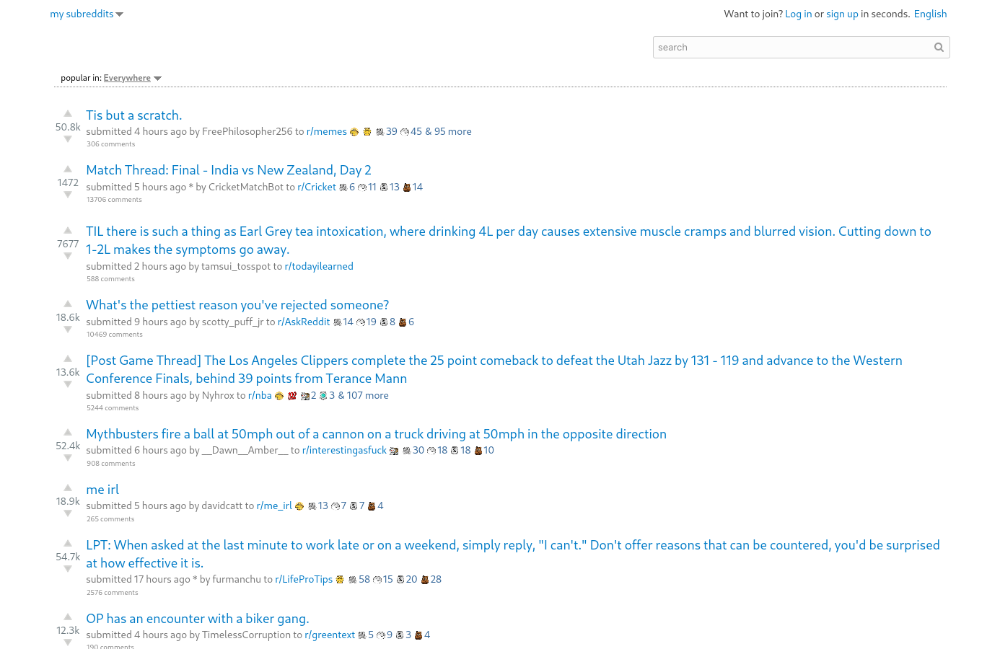
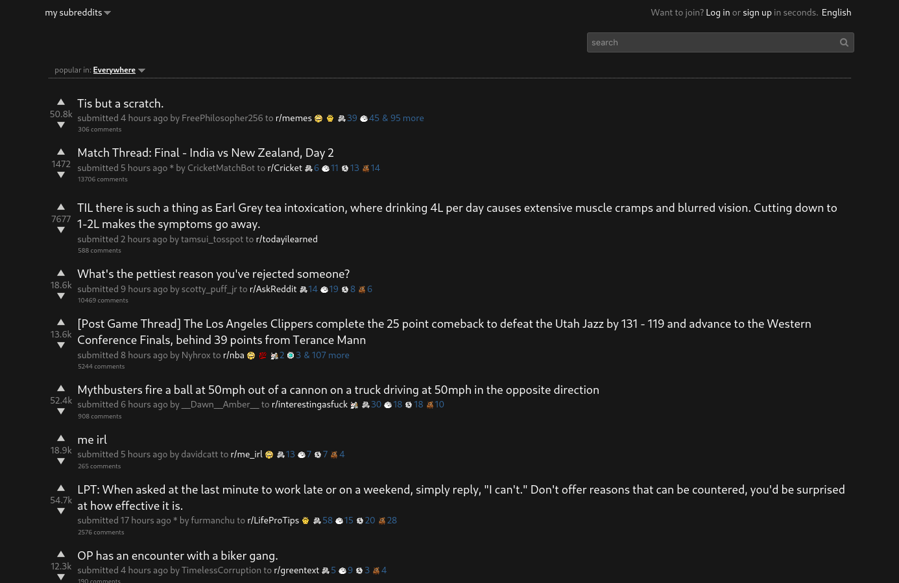

  

    <h3 align="center">(Old) Reddit Bare</h3>
    

      A userstyle that strips (old) Reddit down to the bare minimum.
    

  

## About

This userstyle is based on [jasonlong/reddit-tighty-whities](https://github.com/jasonlong/reddit-tighty-whities) created by [jasonlong](https://github.com/jasonlong), which is no longer maintained. This fork fixes some minor issues and offers a dark theme variant.

## Usage

1. Install the Stylus extension for [Firefox](https://addons.mozilla.org/en-US/firefox/addon/styl-us/) or [Chromium](https://chrome.google.com/webstore/detail/stylus/clngdbkpkpeebahjckkjfobafhncgmne).
2. Install the theme by clicking here for either the [light](https://raw.githubusercontent.com/losuler/reddit-bare-userstyle/master/reddit-bare-light.user.css) or [dark](https://raw.githubusercontent.com/losuler/reddit-bare-userstyle/master/reddit-bare-dark.user.css) theme (should open in Stylus).

## Screenshots

&nbsp;

